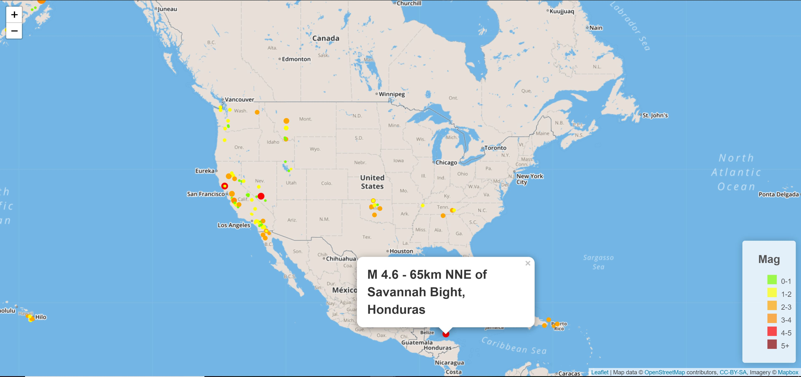

# usgs-leaflet
Data for this application was taken from the USGS's main website: <https://earthquake.usgs.gov/earthquakes/feed/v1.0/geojson.php>

## Purpose:
This repo showcases geomapping with Leaflet.js.  This application takes earthquake GeoJSON data from the USGS's main website and visually marks the earthquake locations on a map.  Each earthquake is denoted with a circle whose radius and color varies based on the magnitude of the eathquake.  A legend is also given in the bottom right corner.  Each circle also has a tooltip the provides the location and magnitude of the earthquake.

## Tools Used:
* HTML, CSS, JavaScript
* D3.js
* Leaflet.js

## Application Screenshot
